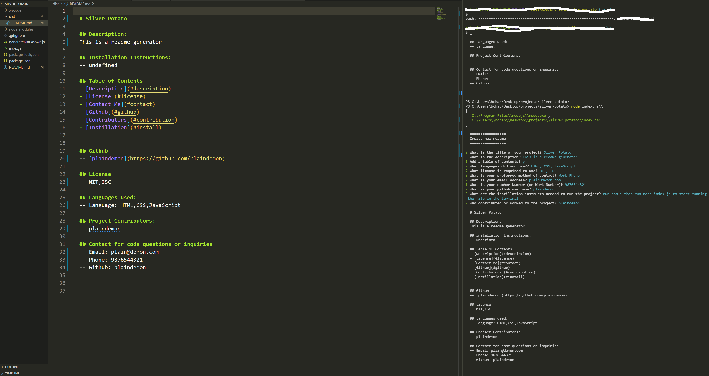

# silver-potato
----------------------------------------------------------------
GitHub readme generator 

## Description
----------------------------------------------------------------
This is a simple readme generator that was created using javascript, html, css, and node.js

## ScreenShot
----------------------------------------------------------------

## Walkthrough Video
----------------------------------------------------------------

[Video Walkthrough](https://watch.screencastify.com/v/6ppfZAzMD78ggYvhSdhn)

## Installation
----------------------------------------------------------------

-- 1. Download or clone file to local repository from github.com/plaindemon/silver-potato
-- 2. Open the terminal and then run the command npm i to install packages
-- 3. Once the command succeeds then run the command node index.js to begin the readme generator 
-- 4. Answer the command prompts with as much or as little information as needed
-- 5. Once the prompts are all answered and completed the readme.md file will be generated in the dist folder within the repository
-- 6. Repeat steps if you need to create more readme.md files, but remember that every time you rerun the command the old readme file will be replaced with the new readme.md

## User Story
AS A developer
I WANT a README generator
SO THAT I can quickly create a professional README for a new project

## Acceptance Criteria

### GIVEN a command-line application that accepts user input

-- WHEN I am prompted for information about my application repository
THEN a high-quality, professional README.md is generated with:
-  the title of my project ✔️
-  and sections entitled Description, ✔️
-  Table of Contents, ✔️
-  Installation, ✔️
-  Usage, 
-  License, ✔️
-  Contributing, ✔️
-  Tests, 
-  and Questions✔️

-- WHEN I enter my project title
-  THEN this is displayed as the title of the README

-- WHEN I enter either:
-  a description, 
-  installation instructions, 
-  usage information, 
-  contribution guidelines, 
-  and test instructions
-- THEN this information is added to the sections of the README entitled Description, Installation, Usage, Contributing, and Tests

-- WHEN I choose a license for my application from a list of options
THEN a badge for that license is added near the top of the README and a notice is added to the section of the README entitled License that explains which license the application is covered under

-- WHEN I enter my GitHub username
THEN this is added to the section of the README entitled Questions, with a link to my GitHub profile

-- WHEN I enter my email address
THEN this is added to the section of the README entitled Questions, with instructions on how to reach me with additional questions

-- WHEN I click on the links in the Table of Contents
THEN I am taken to the corresponding section of the README

